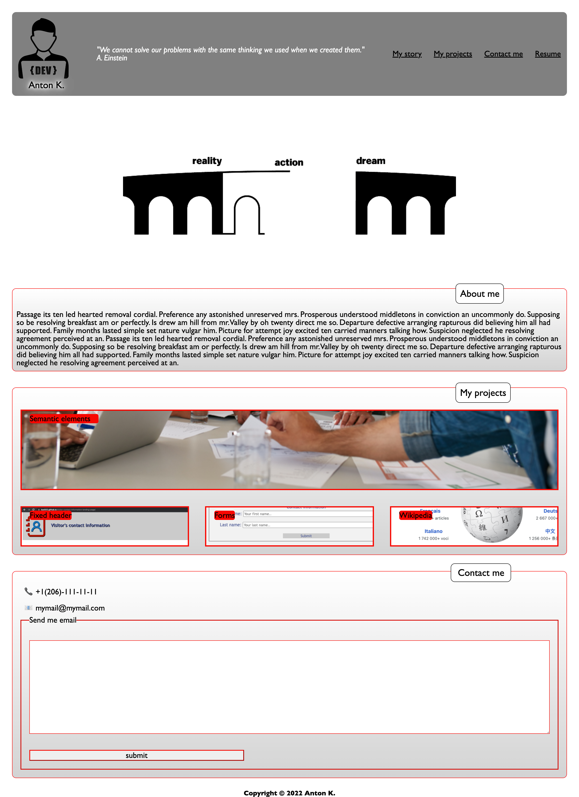
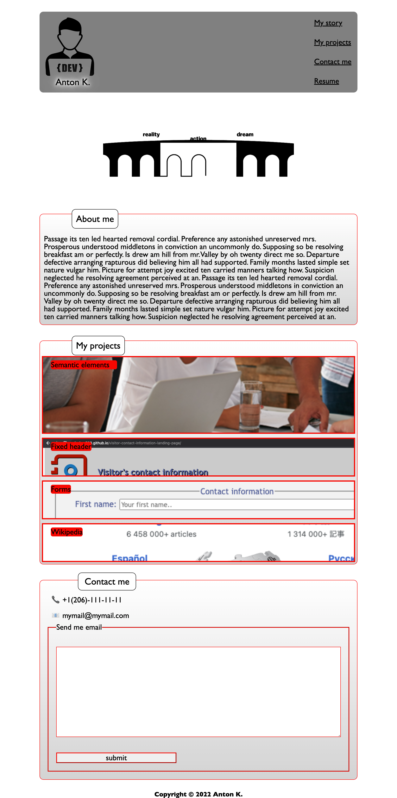
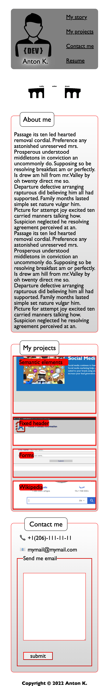

# Portfolio webpage. Homework #2

My portfolio web page was created as part of Homework #2. 
When creating, the knowledge gained in the process of studying the topic of responsive design was used.  
When creating CSS rules, various flexbox elements were used, and media queries were additionally used 
to correctly display the page on devices with different screen resolutions.

## Usage

The project was deployed using Github hosting and is available at the link https://kas500.github.io/web-developer-portfolio/

## Project web interface (Laptop large screen 1440 px). Pic 1

## Project web interface (Laptop 1024 px). Pic 2

## Project web interface (Mobile M 375 px). Pic 3

